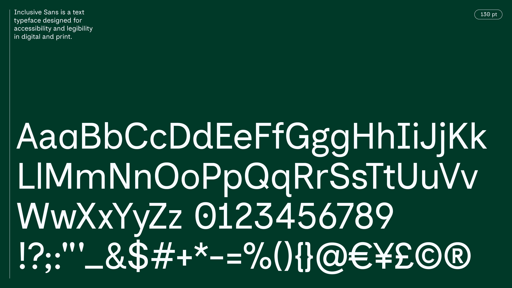
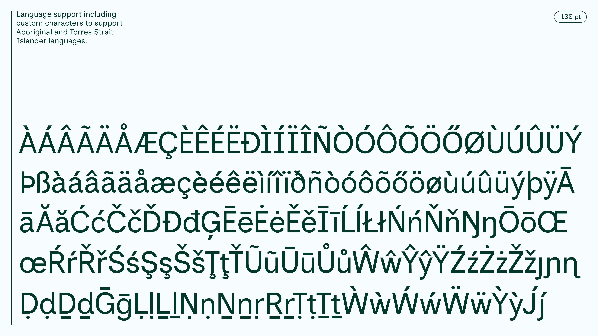
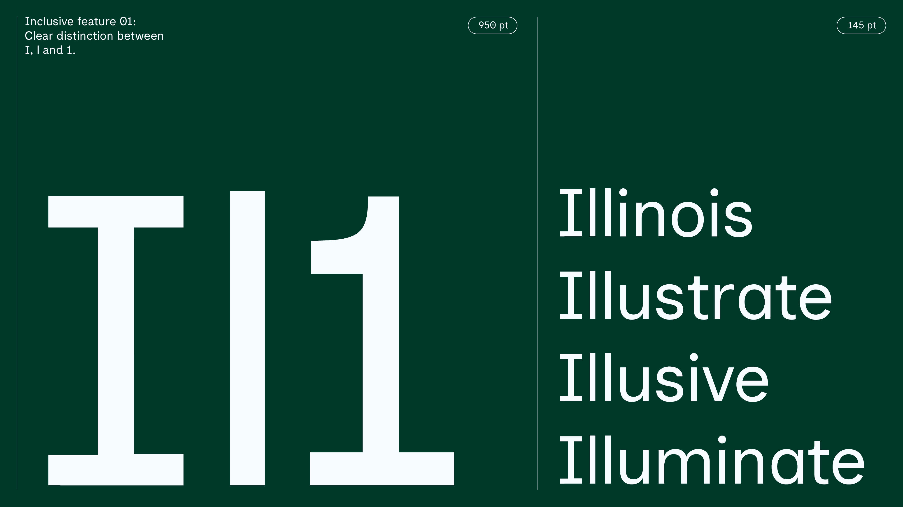
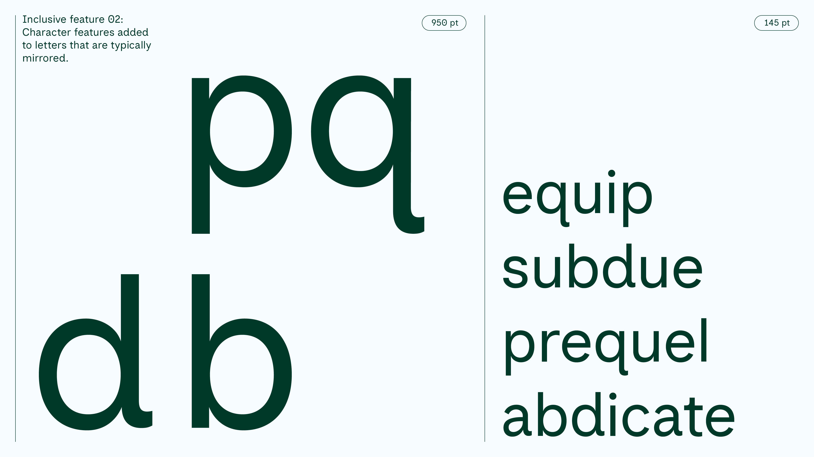
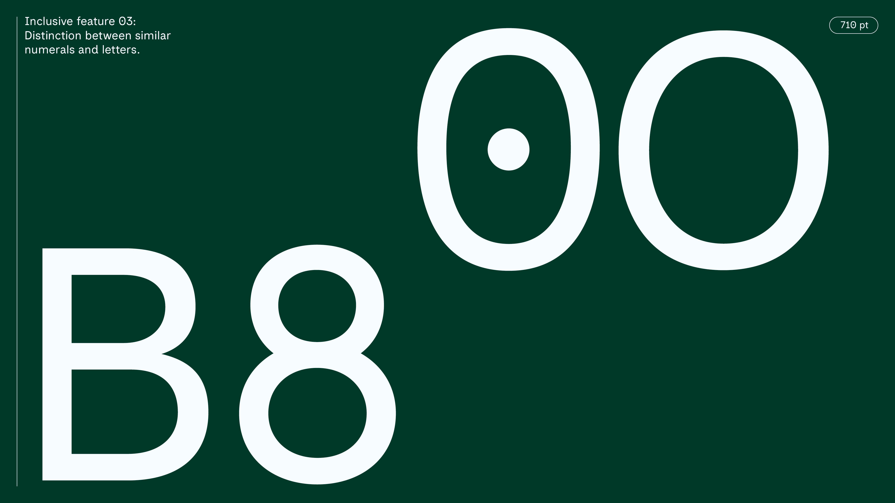
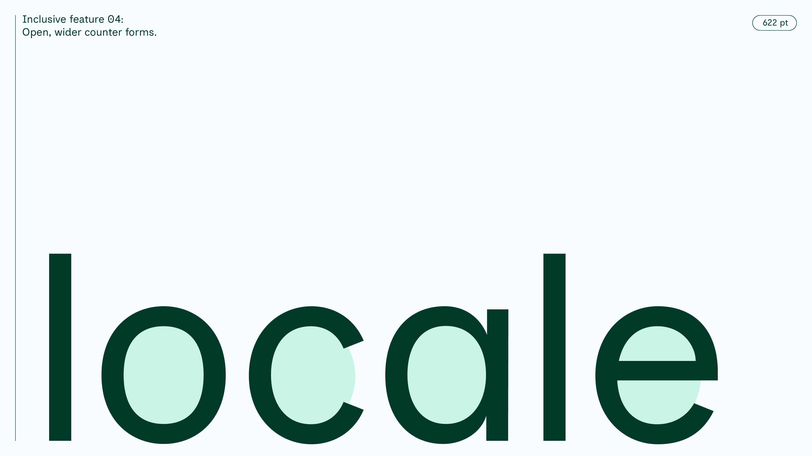
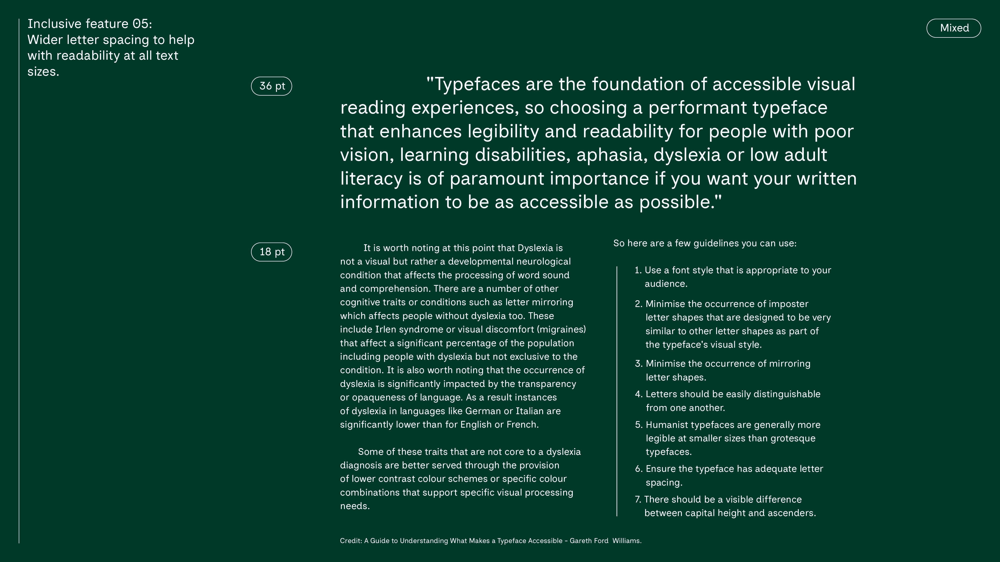

# Inclusive Sans

[![][Fontbakery]](https://LivKing.github.io/Inclusive-Sans/fontbakery/fontbakery-report.html)
[![][Universal]](https://LivKing.github.io/Inclusive-Sans/fontbakery/fontbakery-report.html)
[![][GF Profile]](https://LivKing.github.io/Inclusive-Sans/fontbakery/fontbakery-report.html)
[![][Outline Correctness]](https://LivKing.github.io/Inclusive-Sans/fontbakery/fontbakery-report.html)
[![][Shaping]](https://LivKing.github.io/Inclusive-Sans/fontbakery/fontbakery-report.html)

[Fontbakery]: https://img.shields.io/endpoint?url=https%3A%2F%2Fraw.githubusercontent.com%2FLivKing%2FInclusive-Sans%2Fgh-pages%2Fbadges%2Foverall.json
[GF Profile]: https://img.shields.io/endpoint?url=https%3A%2F%2Fraw.githubusercontent.com%2FLivKing%2FInclusive-Sans%2Fgh-pages%2Fbadges%2FGoogleFonts.json
[Outline Correctness]: https://img.shields.io/endpoint?url=https%3A%2F%2Fraw.githubusercontent.com%2FLivKing%2FInclusive-Sans%2Fgh-pages%2Fbadges%2FOutlineCorrectnessChecks.json
[Shaping]: https://img.shields.io/endpoint?url=https%3A%2F%2Fraw.githubusercontent.com%2FLivKing%2FInclusive-Sans%2Fgh-pages%2Fbadges%2FShapingChecks.json
[Universal]: https://img.shields.io/endpoint?url=https%3A%2F%2Fraw.githubusercontent.com%2FLivKing%2FInclusive-Sans%2Fgh-pages%2Fbadges%2FUniversal.json

Inclusive Sans is a text font designed for accessibility and readability. It is inspired by the friendly personality of contemporary neo-grotesques while incorporating key features to make it highly legible in all uses. 

## Background

The conversation and guidelines around accessibility in typography has largely centred on type sizes and colour contrasts [^1]. However research [^2] has shown that accessibility in type is crucial at a character level, where key features can enhance the readability of text for those who are hard of seeing or are neurodiverse. 

After reading Sophie Beier's book Reading Letters: Designing for Legibility [^3], working with clients across in disability non-for-profits and large government organisations, as well as conversations with fellow designer Johanna Roca, Olivia King was inspired to create a typeface that was truly legible at a character level. While some typefaces had been created in the same spirit [^4], she wanted to create a font that was more contemporary and usable as a text typeface for all types of use. 

To meet the criteria as outlined in Beier's work as well as Gareth Ford William's Guide [^5], Inclusive Sans incorporates the following key features:

1. Clear distinction between I, l and 1
2. Non-mirroring of letters d, b, q and p
3. Distinction between O and 0
4. Wider, more open counter forms on c, o, a and e
5. A higher x-height for easier readability at small sizes
6. Wider default letter-spacing 
7. Clear difference between capital height and ascender height

In early 2021 Olivia started work on the regular weight of Inclusive Sans while participating in a 10 week type design course run by Troy Leinster, and by August that year she had completed the majority of the full Latin set. Living and working on Gadigal Country (Sydney, Australia) she felt it was important to include support for Aboriginal and Torres Strait Islander languages. She added an additional 48 glyphs with the help of Vincent Chan (in consultation with Sasha Wilmouth from the University of Melbourne).

Additional weights and styles are currently in development.

[^1]: See WCAG 2 section 1.4 on Distinguishable https://www.w3.org/WAI/WCAG21/quickref/#distinguishable
[^2]: See Sophie Beier's 2009 thesis on typeface legibility
[^3]: http://sofiebeier.dk/?page_id=390
[^4]: https://www.myfonts.com/collections/fs-me-font-fontsmith
[^5]: https://medium.com/the-readability-group/a-guide-to-understanding-what-makes-a-typeface-accessible-and-how-to-make-informed-decisions-9e5c0b9040a0

## Building

Fonts are built automatically by GitHub Actions - take a look in the "Actions" tab for the latest build.

If you want to build fonts manually on your own computer:

* `make build` will produce font files.
* `make test` will run [FontBakery](https://github.com/googlefonts/fontbakery)'s quality assurance tests.
* `make proof` will generate HTML proof files.

The proof files and QA tests are also available automatically via GitHub Actions - look at https://LivKing.github.io/Inclusive-Sans.

## Changelog

When you update your font (new version or new release), please report all notable changes here, with a date.
[Font Versioning](https://github.com/googlefonts/gf-docs/tree/main/Spec#font-versioning) is based on semver. 
Changelog example:

**26 May 2021. Version 2.13**
- MAJOR Font turned to a variable font.
- SIGNIFICANT New Stylistic sets added.

## License

This Font Software is licensed under the SIL Open Font License, Version 1.1.
This license is available with a FAQ at
https://scripts.sil.org/OFL

## Repository Layout

This font repository structure is inspired by [Unified Font Repository v0.3](https://github.com/unified-font-repository/Unified-Font-Repository), modified for the Google Fonts workflow.
